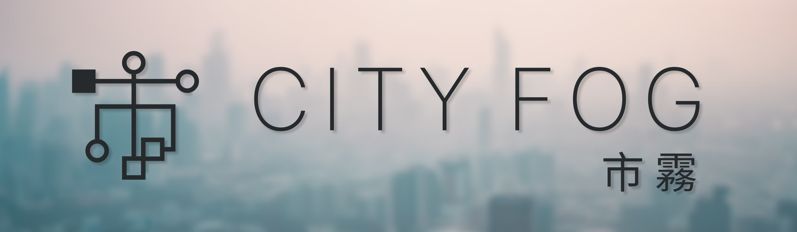

# 市 霧 City Fog, Dawn (Light Theme)
## A light mode version of the [City Fog VS Code theme](https://marketplace.visualstudio.com/items?itemName=metalloriff.city-fog)

# 📷 Screenshots

# 

# 

#
# 👩‍💻 Language Support
### City Fog should support most/all languages, if you are experiencing issues with a specific language, please [contact me](mailto:metalloriff@gmail.com), or create a PR, and I will look into it. 😄
# 
# 🌏 Contributing
### This is my first VS Code theme and/or extension!
### It's bound to have issues; if you find any of these and wish to resolve them, I will gladly accept PRs, or, you may create an issue on the repo and I will respond when I see it.
# 
# 🌃 Dark Mode
### You can find the original, dark mode [here](https://marketplace.visualstudio.com/items?itemName=metalloriff.city-fog-dark)!
#
# 🎨 My Other Works
### If you would like to check out my other works, you can view all of my public personal projects at [kinzoku.one](https://kinzoku.one)!
# 
# ☕ Donate
### If you would like to donate, anything is appreciated!
### You can do so at my [PayPal.me](https://paypal.me/israelboone) ♥